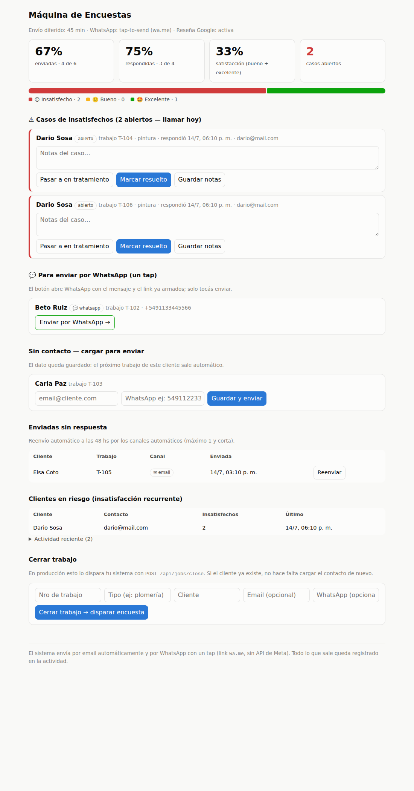

# Máquina de Encuestas

Encuestas de satisfacción post-trabajo para un negocio de servicios: el cierre
del trabajo dispara automáticamente una encuesta de **una sola pregunta** al
cliente (por email o WhatsApp), y el dueño gestiona todo desde un tablero:
métricas, casos de insatisfechos con seguimiento, y reenvíos con límite.

Diseñado a partir de [`docs/user-journey.md`](docs/user-journey.md) y evolucionado
con lo adoptado en [`docs/comparacion-flujo-berlim.md`](docs/comparacion-flujo-berlim.md).



## Cómo correr

**Cero dependencias**: solo Node.js ≥ 22 (usa `node:http` y `node:sqlite`; el
frontend es una SPA estática sin build).

```bash
node server.js        # tablero en http://localhost:3000
node --test test.js   # tests end-to-end (flujos + scheduler)
```

> Si venís del MVP v1, borrá `encuestas.db` (el esquema cambió).

## Canales de envío — automatizar sin depender de Meta

El requisito: automatizar envío y recolección **sin** atarse a la API de
WhatsApp Business (aprobación de Meta, complejidad de integración). El sistema
resuelve el envío por canal según el contacto disponible:

| Canal | Cómo funciona | Automatización |
|---|---|---|
| **Email** (default si hay email) | El mensaje sale a `SEND_WEBHOOK_URL` (Resend, SES, Zapier, n8n…) | 100% automática |
| **WhatsApp tap-to-send** (si solo hay teléfono) | El sistema arma un link `wa.me` con el mensaje y el link a la encuesta ya escritos; el operario lo toca en el tablero y sale desde su propio WhatsApp | Un tap — sin API de Meta, sin aprobación |
| **WhatsApp gateway** (opcional) | Si configurás `WHATSAPP_WEBHOOK_URL` (Twilio, un BSP, n8n), el envío pasa a ser 100% automático | 100% automática |

La **recolección** es siempre automática: el cliente responde en una página
pública de un tap (sin login) y la respuesta impacta en el tablero al instante.
Todo lo que sale queda registrado en la tabla `outbox` (auditable en la
sección "Actividad" del tablero).

## El flujo completo

1. **Cierre del trabajo** → `POST /api/jobs/close` (idempotente por `ref`).
   Si el cliente ya tiene contacto guardado, no hay que cargar nada.
2. **Envío diferido** → la encuesta se programa a los `SEND_DELAY_MINUTES`
   (default 45) para que llegue cuando el cliente ya vivió el resultado.
3. **Envío** → automático (email/gateway) o tap-to-send (WhatsApp sin gateway).
   Sin contacto: queda visible en el tablero; al cargarlo una vez, **queda en
   memoria** para el próximo trabajo de ese cliente.
4. **Respuesta** → 1 pregunta, 3 botones (😞 🙂 🤩), sin login, idempotente.
   - **Excelente** → CTA de reseña pública en Google (`GOOGLE_REVIEW_URL`).
   - **Insatisfecho** → alerta inmediata al dueño + **caso** abierto.
5. **Casos** → `abierto → en_tratamiento → resuelto`, con notas, seguimiento
   automático semanal al dueño mientras siga abierto, y agradecimiento al
   cliente al resolver (con foco en la resolución).
6. **Seguimiento de no respondidas** → reenvío automático a las
   `AUTO_REMINDER_HOURS` (default 48) por canales automáticos, **máximo 1 y
   corta** (regla anti-spam aplicada en el servidor, no solo en la UI).

El tablero muestra los 4 números (% enviadas, % respondidas, % satisfacción,
desglose), los casos, las colas de acción y los **clientes en riesgo**
(insatisfacción recurrente).

## Configuración (env, todo opcional)

| Variable | Default | Para qué |
|---|---|---|
| `PORT` / `BASE_URL` | `3000` / `http://localhost:PORT` | URL pública (va en los links de encuesta) |
| `DB_PATH` | `encuestas.db` | Archivo SQLite |
| `SEND_DELAY_MINUTES` | `45` | Envío diferido post-cierre (0 = inmediato) |
| `AUTO_REMINDER_HOURS` | `48` | Reenvío automático si no respondió (0 = off) |
| `CASE_FOLLOWUP_DAYS` | `7` | Frecuencia del seguimiento de casos abiertos |
| `GOOGLE_REVIEW_URL` | — | Link de reseña que ve quien responde "excelente" |
| `SEND_WEBHOOK_URL` | — | Transporte de email (sin esto, queda solo en outbox — modo dev) |
| `WHATSAPP_WEBHOOK_URL` | — | Gateway de WhatsApp (sin esto, modo tap-to-send) |
| `ALERT_WEBHOOK_URL` | `SEND_WEBHOOK_URL` | Alertas y seguimientos al dueño |
| `OWNER_CONTACT` | — | Destinatario de alertas/seguimientos |

El payload de todos los webhooks es
`{kind, channel, recipient, subject, body}` — un `if` en Zapier/n8n alcanza
para rutearlo a cualquier proveedor.

## API

| Método y ruta | Qué hace |
|---|---|
| `POST /api/jobs/close` | Hook de cierre: `{ref, type?, client_name, client_email?, client_phone?}` |
| `GET /api/state` | Todo el estado del tablero en un call |
| `GET /api/metrics` | Solo los números |
| `POST /api/surveys/:id/contact` | Carga contacto faltante (`{email?, phone?}`) y envía |
| `POST /api/surveys/:id/resend` | Reenvío manual por canal automático (máx. 1) |
| `GET /wa/:id` | Tap-to-send: marca enviada/reenviada y redirige a `wa.me` |
| `POST /api/cases/:id` | Estado y notas del caso (`{status?, notes?}`) |
| `GET /s/:token` · `POST /s/:token` | Encuesta pública (1 tap, sin login) |

## Estructura

```
server.js      rutas + flujo core + páginas públicas de encuesta (SSR)
db.js          esquema y consultas (node:sqlite)
notify.js      outbox + webhooks + links wa.me + textos de mensajes
scheduler.js   envíos diferidos, recordatorios 48hs, seguimiento de casos
public/        tablero (SPA vanilla: index.html, app.js, style.css)
test.js        tests end-to-end contra el server real (incluye scheduler)
docs/          user journey, comparación con flujo BERLIM, capturas
```

## Qué queda para después

- **Múltiples encuestas por tipo de servicio** (etapa 2 del journey): tabla de
  plantillas + mapeo desde `jobs.type`; el campo ya se guarda.
- **NPS 0-10**: migrable cuando haya tasa de respuesta medida — el desglose
  actual mapea a detractor/pasivo/promotor.
- **Autenticación del tablero**: hoy no tiene (correr detrás de una VPN o
  reverse proxy con auth hasta agregarla).
